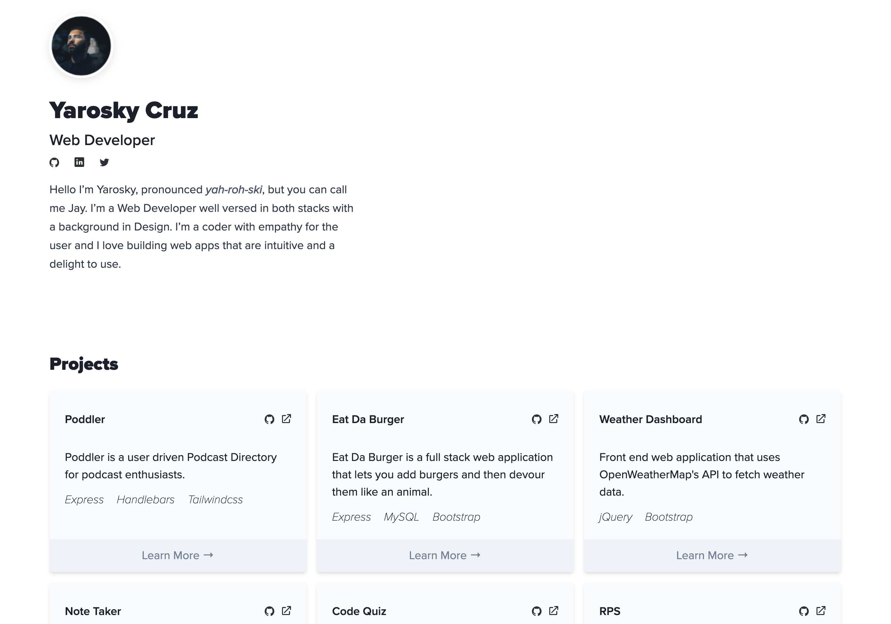

# Portfolio-2020 
#### [Demo](https://yarocruz.surge.sh/) 


## Description

This is my portfolio, there are many like it, but this one is mine. It is never done and will always and will forever be a work in progress.
It's a very simple single page site. This is on purpose. It includes a brief intro, six of my latest projects, and a working contact form. The minimalist and 
clean look is also intentional.

## Technologies

 I built the portfolio with [Gatsby](https://www.gatsbyjs.org/), a [React](https://reactjs.org/) based framework for building websites and apps. 
 Gatsby is particularly very good at building out for you a blazing fast static site. For styling, I grabbed [Tailwind CSS](https://tailwindcss.com/), my
 favorite CSS framework right now. 

## Usage and Installation

This project has an [MIT](/LICENSE) License, so it is safe to clone or fork. However, be polite and attribute back to me if you do a complete
copy+pasta. Some familiarity with React is recommended if you are going to customize this project and the tooling ecosystem. You need Node.js with NPM
installed in your system. After that you need to install the Gatsby CLI:

```
npm install -g gatsby-cli
```
I highly recommend going through the Gatsby Documentation and going through [their tutorials](https://www.gatsbyjs.org/tutorial/part-zero/). 

## Problems / Solutions

There's a couple of things I need to tweak and fix for the project. I could definitely refactor the code. The styles for example are a mishmash of inline
and linked CSS classes from Tailwind. I think it needs some top navigation for when you go in to view more details about a project, but I haven't come up with a
solution that will keep the look of the site minimal and clean. 

The meat of the action on the site, and what I think makes it worth using a React based tool like Gatsby, is in the projectCard component. If I need to 
update one of the projectCards I can quickly pass down 'props'.

```
<ProjectCard
  title="Poddler"
  githubLink="https://github.com/yarocruz/project-2"
  demoLink="https://sheltered-gorge-46855.herokuapp.com/"
  description="Poddler is a user driven Podcast Directory for podcast enthusiasts."
  tech={["Express", "Handlebars", "Tailwindcss"]}
  pageRoute="/poddler/"
/>
```
## Demo

You can see my portfolio at [yarocruz.surge.sh](https://yarocruz.surge.sh/). The site is 'deployed' with [Surge](https://surge.sh/) which is one
of the simplest and sweetest things when it comes to hosting static sites.

## Questions?


Have any questions? Want to collaborate on a project? Shoot me an [email](yarocruz@gmail.com)